## 1.Text-CNN [原论文](http://arxiv.org/abs/1510.03283/"原论文")(Text-Attentional Convolutional Neural Networks for Scene Text Detection)

### 网络结构

Text-Attentional Convolutional Neural Network(Text-CNN)+ Contrast Enhancement Maximally Stable Extremal Regions (CE-MSERs)

其中text-cnn侧重于从图像组件中提取与文本相关的区域和特征,过滤非文本区域，结构如图1：

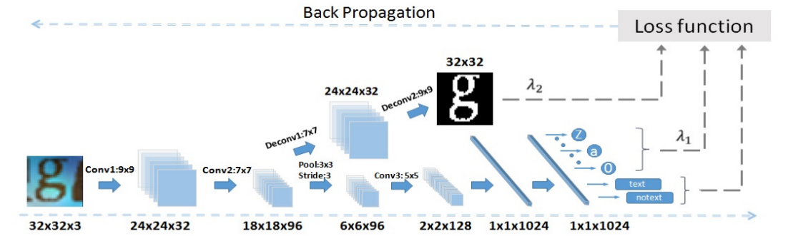

​								图一：text-cnn结构

- pixel-level segementation task: Conv1 → Conv2 → Deconv1 → Deconv2 → loss (5) 【两个卷积，两个去卷积】

- character label task: Conv1 → Conv2 → Pool2 → Conv3 → Fc1 → Fc2 → loss  (4)     【三个卷积，一个池化，两个全连接】

- text/non-text task: Conv1 → Conv2 → Pool2 → Conv3 → Fc1 → Fc2 → loss  (3)       【三个卷积，一个池化，两个全连接】

  ​

CE-MSERs是一个强大的探测器称为低对比度增强的最大稳定极值区域，能够提高文本模式和背景之间的灰度对比度。这使得它能够检测具有高度挑战性的文本模式，从而获得更高的召回率(recall)。

### 训练细节

####训练数据

训练用了2个数据集，分别是CharSynthetic 和 CharTrain。

CharSynthetic：80141个特征图片，包含labels和character mask。

​					    			图像样本和文本区域

 CharTrain ：17733个文本(字符)样本和85581个非文本样本

#### 训练过程

- pre-train：label task和region task分别按10:3（损失函数比，λ1 =1，λ2 =0.3）进行训练，采用的库为合成数据库charSynthetic，迭代次数为30k次

  ​

- train：label task和main task分别按3:10（λ1 =0.3）进行训练，采用的库为真实库charTrain，迭代次数为70k

  ​

- 之所以这样训练的原因：三种任务使用的特征不同（region task使用的特征是pixel-level，属于低级特征），收敛的速度也不同。如果region task训练次数和main task一样多，会导致过拟合。第一阶段训练两个任务之后，模型参数已经将像素级的信息记录下来了。下图为训练阶段三种任务的损失函数随迭代次数的变化情况。

  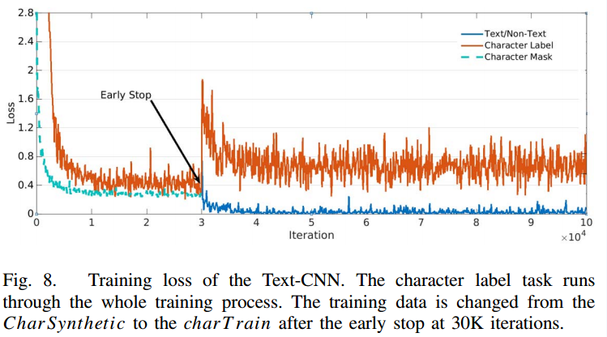

### 结果

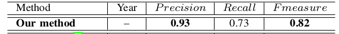

​							ICDAR 2013数据集上结果

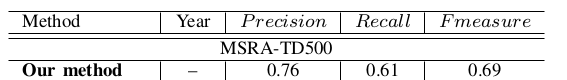

​							MSRA-TD500数据集上结果

### 速度

文中未提，但是CE-MSERs特别耗时。

#2.CTPN[原论文](http://arxiv.org/abs/1609.03605>/"原论文")(Detecting Text in Natural Image with Connectionist Text Proposal Network)

### 网路结构

Connectionist Text Proposal Network(CTPN)能够准确的在自然图片中划出文本线。网络结构如下：

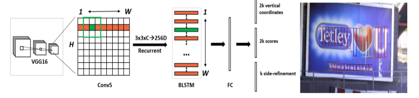

​			a.网络结构														b.效果展示

- 第一，用VGG16的前5个Conv stage（到conv5）得到feature map(W×H×C)
- 第二，在Conv5的feature map的每个位置上取3×3×C的窗口的特征，这些特征将用于预测该位置k个anchor（大概为预测框的意思）对应的类别信息，位置信息。
- 第三，将每一行的所有窗口对应的3×3×C的特征（W×*3×*3×C）输入到RNN（BLSTM）中，得到W*256的输出
- 第四，将RNN的W*256输入到512维的fc层
- 第五，fc层特征输入到三个分类或者回归层中。第二个2k scores 表示的是k个anchor的类别信息（是字符或不是字符）。第一个2k vertical coordinate和第三个k side-refinement是用来回归k个anchor的位置信息。2k vertical coordinate表示的是bounding box的高度和中心的y轴坐标（可以决定上下边界），k个side-refinement表示的bounding box的水平平移量。这边注意，只用了3个参数表示回归的bounding box，因为这里默认了每个anchor的width是16，且不再变化（VGG16的conv5的stride是16）。回归出来的box如b中那些红色的细长矩形，它们的宽度是一定的。
- 第六，用简单的文本线构造算法，把分类得到的文字的proposal（图b中的细长的矩形）合并成文本线

### 方法细节

####Detecting Text in Fine-scale proposals

会预测出一些文本框，即为k个anchor，通过网络训练来达到回归。

k个anchor尺度和长宽比设置：宽度都是16，k = 10，高度从11~273（每次除于0.7）

回归的高度和bounding box的中心的y坐标如下，带*的表示是groundTruth，带a的表示是anchor

当Iou>0.7为正样本，<0.7为负样本，预测的框错误 。

#### Recurrent Connectionist Text Proposals	

RNN类型：BLSTM（双向LSTM），每个LSTM有128个隐含层

RNN输入：每个滑动窗口的3*3*C的特征（可以拉成一列），同一行的窗口的特征形成一个序列

RNN输出：每个窗口对应256维特征

可以使网络具有上下文预测功能，让网络更强大

#### Side-refinement

- - 文本线构造算法（多个细长的proposal合并成一条文本线）

    - 主要思想：每两个相近的proposal组成一个pair，合并不同的pair直到无法再合并为止（没有公共元素）
    - 判断两个proposal，Bi和Bj组成pair的条件：
      1. Bj->Bi， 且Bi->Bj。（Bj->Bi表示Bj是Bi的最好邻居）
      2. Bj->Bi条件1：Bj是Bi的邻居中距离Bi最近的，且该距离小于50个像素
      3. Bj->Bi条件2：Bj和Bi的vertical overlap大于0.7

    ​

### 结果

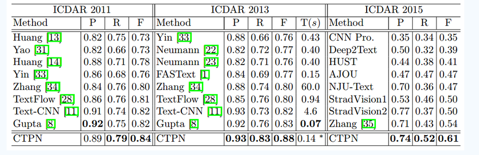

​							ICDAR2011，ICDAR2013，ICDAR2015库上检测结果

### 速度

The CTPN is efficient by achieving new state-of-the-art performance on five benchmarks, with 0.14s/ image running time.

github(Tensorflow): <https://github.com/eragonruan/text-detection-ctpn>

##3.Text-boxes[原论文](http://arxiv.org/abs/1611.06779>/"原论文")(TextBoxes: A Fast Text Detector with a Single Deep Neural Network)

### 网络结构（SSD+NMS）

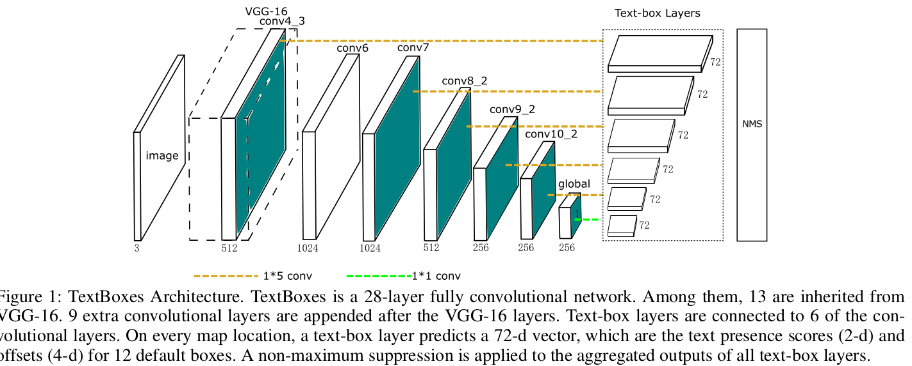

TextBoxes的结构如上，TextBoxes是一个28层的全连接卷积网络。其中13层是继承的VGG-16的网络结构，保留了vgg16的conv1_1到conv4_3的层，vgg16最后的全连接层转换成了参数下采样的卷积层，后面在了一些卷积核池化层，称为conv6到pool11层，额外的9个卷积层添加在VGG-16层之后，Text-box层连接着6个卷积层。在每一个特征位置，一个text-box预测72维向量，这是文本出现的得分（text presencscores）（2维）和12个默认盒子的偏移（offsets）（4层）。一个非最大抑制（NMS）用来聚合所有文本盒子（text-boxlayers）层的输出。

### 训练细节

#### Text-box layers

Text-box层是TextBoxes的关键组件，一个text-box层同时预测文本存在和边界盒子（bounding boxes），以输入的特征图为条件，在每一个图的位置，输出分类的得分和相关默认盒子的卷积偏移。假设图片和特征图的大小单独用（wim,him）和(wmap,hmap)来表示。在一个和默认盒子b0=(x0,y0,w0,h0)相关的图位置（map location）(i,j)，text-box层预测（△x, △y，△w, △h,c），表明一个盒子b=（x,y,w,h）以置信度c检测到了。

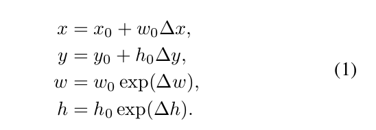

在训练阶段，ground-truth单词盒子与默认盒子根据盒子覆盖度（boxoverlap）对应。根据匹配规则，每一个图位置和多个不同大小的默认盒子对应。这样就高效的把单词分为不同的纵横比和比例，并且TextBoxes还可以学习特定的回归和分类权重来处理相似大小的单词。因此，默认盒子的设计是与特定任务息息相关的。

 

和一般的物体不一样，单词往往有较大的纵横比。因此，我们设计了长的有大纵横比的默认盒子。特别地，我们设计了6种不同纵横比率的默认盒子，分别是1,2,3,5,7和10.可是，这使得在水平方向上的默认盒子密集而在垂直方向上的默认盒子变得稀疏，这会导致很差的匹配盒子（poor matchingboxes）。

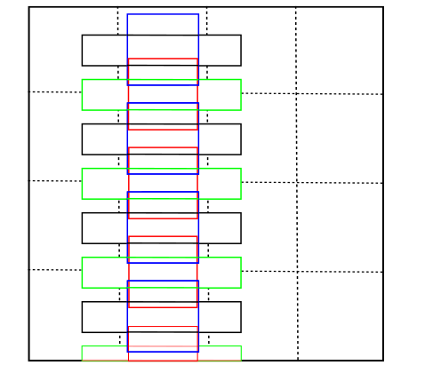

上图为4*4网格的默认盒子的解释，为了更好的可视化，仅仅只有一列默认盒子的纵横比为1和5被描绘出来。剩下的纵横比是2,3,7,10，放的方法都是相似的。黑色（纵横比是5）和蓝色的（纵横比是1）默认盒子位于单元的中心位置。绿色的（纵横比是5）和红色的（纵横比是1）的盒子有相同的纵横比（same aspect ratios）和相对于网格中心的垂直偏移（verticaloffset）（偏移是该单元高的一半）。

另外，在text-box层，我们采取了非常规的1*5的滤波器，而没有采取3*3的滤波器。这种inception风格的滤波器产生矩形接受域（receptive fields），使得能适应大纵横比的单词，也避免了正方形接受域带来的噪声信号（noisysignals）。

#### 训练数据

1、  SynthText，该训练集用来预训练模型

2、  ICDAR 2011 (IC11)，该数据集的测试集合用于评估我们的模型

3、  ICDAR 2013 (IC13)，该数据集合的训练集用于训练

4、  Street View Text (SVT)，SVT数据集比ICDAR数据集更具有挑战性，因为图片的分辨率低。现存的有一些未标记的文本在图片上。我们仅使用数据集做文本识别，识别的词典仅包含50个词。

### 结果

### 速度

0.09s per image with 700 ∗ 700

github: <https://github.com/xiaodiu2010/TextBoxes-TensorFlow>

## 4.SegLink[原论文](https://arxiv.org/abs/1703.06520/'原论文')(Detecting Oriented Text in Natural Images by Linking Segments)

### 网络结构(改进SSD)

其主要思想是将文本分解为两个局部可检测元素，即段(segment)和链接(link)。段是一个覆盖一个词或文本行的一部分的定向框；一个链接连接两个相邻段，表示它们属于同一个词或文本行。

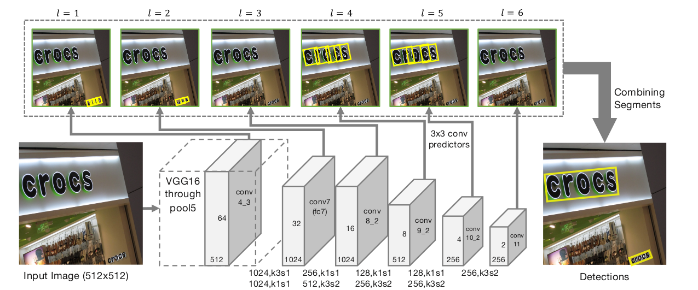网络由卷积特征层（灰色的块）和卷积预测器（灰色的细长箭头）2部分组成。每一层预测出的文本框（黄色的框），最后每个segment会结合起来，也就是前面提到的link。

- 整个检测过程分两步
  - **Step 1:** 图像输入到ssd网络，同时输出两类信息
    1. 第一类信息是text的box信息，有两点需要注意，一是这个box是多方向的，也就是带角度信息的；另一点是box不是整个文本行（或者单词）的box，而是文本行（或者单词）的一个部分，称为**segment**，可能是一个字符，或者一个单词，或者几个字符，比如图fig 1中的每个黄色框即为一个segment。
    2. 第二类信息是不同box的link信息，因为segment是类似于字符级或者单词级的，但最后目标是要输出整个文本行（或者单词），所以如果按以前传统方法，是要后处理把这些segment连接成文本行（或者单词）的，文章的高明之处在于把这个link也弄到网络中去自动学习了，网络自动学习出哪些segment属于同一个文本行（或者单词），比如图fig 1中连接两个黄框的绿色线即为一个link。
  - **Step 2:** 有了segment的box信息和link信息，用一个融合算法得到最后的文本行（或者单词）的box（也是带方向的, x, y, w, h, **θ）**（θ角度信息，多方向）

### 训练细节

- pretrain

  - VGG的SynthText dataset
  - learning rate = 10^-3 for first 60k iterations, decayed to 10^-4 for the rest 30k iterations

- fine tune

  - real data
  - learning rate = 10^-4 for 5-10k iterations

- SGD＋moment = 0.9

- training image size = 384*384

- batch size = 32

- grid search step = 0.1

- **TensorFlow framework**

- Xeon 8-core CPU (2.8 GHz), **4 Titan X Graphics Card**, and 64GB RAM. The training process runs on **4 GPUs in parallel**, with each GPU processing 8 out of the 32 images in a batch at a time. 

- The whole training process takes **less than a day**. Testing is performed on one GPU

  ​

### 结果

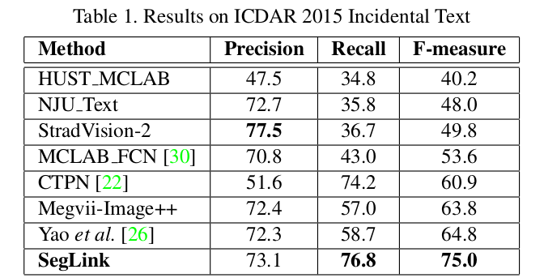

### 速度

这篇文章主要是两点创新，第一加入方向信息把ssd改造成多方向的，第二把link融合到网络一起学习。方法不但性能好，速度真的是相当快，都快达到实时的要求。

github(Tensorflow): <https://github.com/dengdan/seglink>

## 5.EAST[原论文](https://arxiv.org/abs/1704.03155/'原论文')(An Efficient and Accurate Scene Text Detector)

### 网络结构（FCN+NMS）

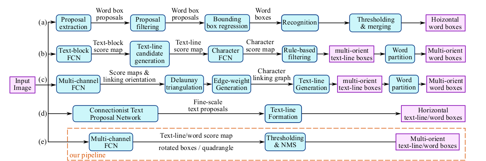

​	(a) Horizontal word detection and recognition pipeline proposed by Jaderberg  (b) Multi-orient text detection pipeline proposed by Zhang et al. (c) Multi-orient text detection pipeline proposed by Yao et al. (d) Horizontal text detection using CTPN, proposed by Tian et al

提出了一个快速准确的场景文本检测流水线，只有两个阶段。 该管道利用完全卷积网络（FCN）模型，直接产生单词或文本行级别预测，不包括冗余和缓慢的中间步骤。 产生的文本预测可以是旋转的矩形或四边形，被发送到非最大抑制（NMS）以产生最终结果。 与现有方法相比，根据标准基准的定性和定量实验，提出的算法实现了显着提高的性能，同时运行更快。 比起cptn，本网络也能发现多方向的文本。

#### FCN网络结构

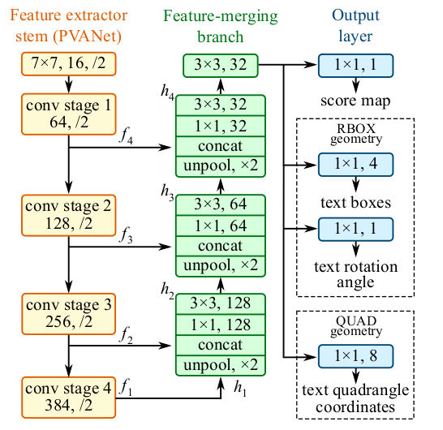

模型可以分为三个部分：特征提取器，特征合并分支和输出层。

此算法遵循一般DenseBox的设计，其中图像被送进FCN，生成我多做点像素级文本分类图和几何的通道。

预测通道的其中之一是分数图，像素值在[0,1]。其余通道表示从每个像素的视图中包围单词的几何尺寸。分数代表了在同样的位置预测的几何尺寸的置信度。

我们深度了两种文本的几何形状，旋转框（RBOX）和四边形（QUAD），并为每种几何形状设计了不同的损失函数。然后阈值应用于每个区域，其中分数超过预定义阈值的几何形状被认为是有效的，并且保存为稍后的非极大值抵制。NMS之后的结果被认为是管道的最终输出。

### 局部感知NMS

为了形成最终结果，阈值化后的几何图形应该由NMS合并。一个简单的NMS算法在O（n2）中运行，其中n是候选几何体的数量，这是不可接受的，因为我们正面临来自密集预测的成千上万个几何体。

在假定来自附近像素的几何图形倾向于高度相关的情况下，我们提出将行几何图形逐行合并，并且在合并同一行中的几何图形时，我们将迭代地合并当前遇到的几何图形。这种改进的技术在O（n）中以最佳方案运行。即使最坏的情况与最初的情况一样，只要局部性假设成立，算法在实践中运行得足够快。程序在算法1中总结。

值得一提的是，在WEIGHTEDMERGE（g，p）中，合并的四边形的坐标通过两个给定四边形的得分进行加权平均。具体而言，如果a = WEIGHTEDMERGE（g，p），则ai = V（g）gi + V（p）pi和V（a）= V（g）+ 
V下标i的坐标，V（a）是几何a的得分。 
事实上，我们正在“平均”而不是“选择”几何形状，这是一个微妙的差别，因为在标准的NMS程序中，作为投票机制，反过来在馈送视频时引入稳定效应。

### 结果

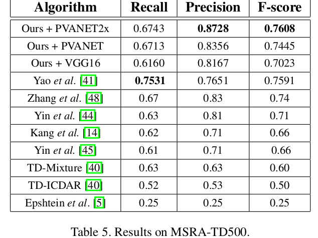

### 速度

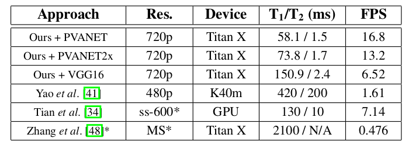

github: <https://github.com/argman/EAST>

##6.SSTD[原论文](https://arxiv.org/abs/1709.00138/'原论文')(Single Shot Text Detector with Regional Attention)

### 网络结构

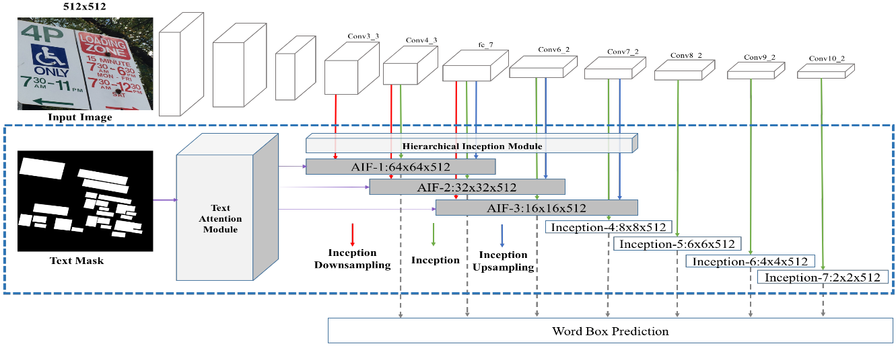

single-shot text detector包含3个主要部分：

1.卷积部分

2.文本的特定部分，其中包括Text Attention Module (TAM)和Hierarchical Inception Module (HIM)，TAM引入了一种新的像素级文本监视机制，允许模型自动学习文本注意图，识别粗糙的文本区域。HIM聚集多层inception网络模块，并增强了对文本任务的卷积特性。

3.文字框预测部分

### 方法细节

#### Text Attention Mechanism

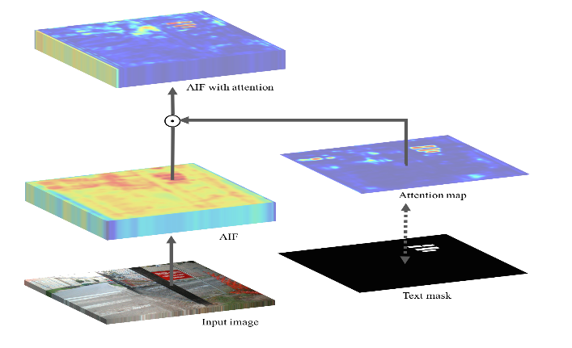

从Aggregated Inception Features (AIFs)计算出文本注意图，文本注意图显示粗糙的文本区域并编码为AIFS。可以通过文本的像素级二进制掩码（trained byusing a pixel-wise binary mask of text）训练。通过attention，(1).减少了错误的识别框。(2).可以使模型去发现更复杂的文本。(3)提高了发现的准确率。

#### Hierarchical Inception Module

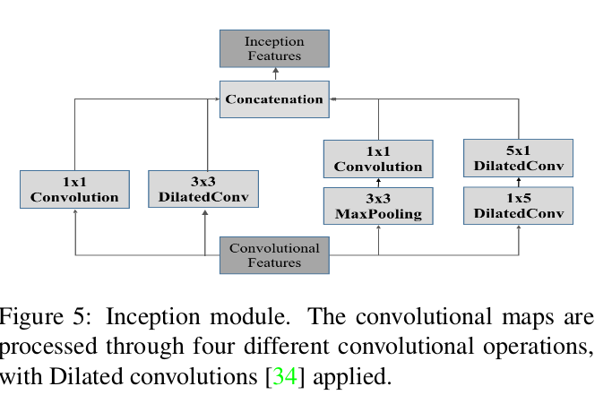

### 训练细节

- pretrain
  - SSD
  - learning rate = 0.001
- SGD＋moment = 0.9
- training image size = 704*704
- batch size = 32
- grid search step = 0.1
- **Caffe framework**
- TiTIAN X GPUS. 
- NMS 阀值 0.3   NMS置信阀值 0.7

### 结果

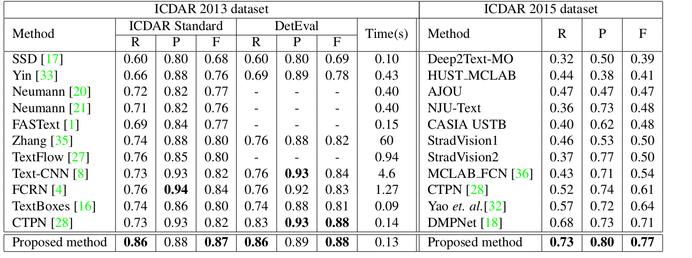

​							各个方法间的比较

