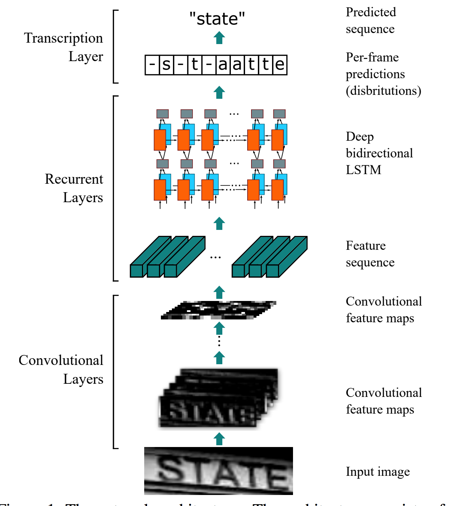
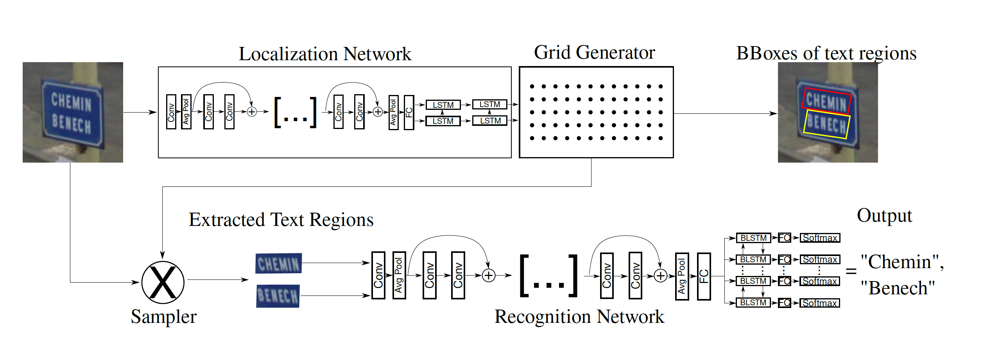
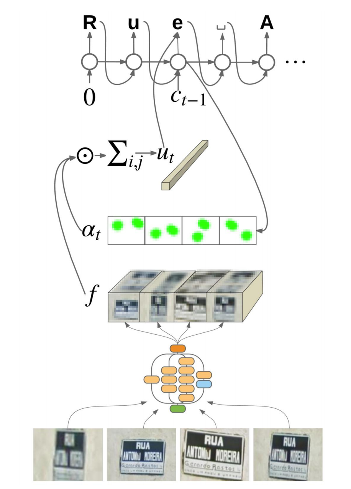

# Recognition

大体思路分为两种：

1. buttom-up 将图像分割为单子，逐字识别，再合并。
2. up-buttom 直接识别句子。

目前来看，**自然场景**很难进行文字分割，故多采用深度学习进行up-buttom方法整行识别。

## [CRNN](https://arxiv.org/pdf/1507.05717.pdf)

### 算法思路

**CNN+BiLSTM+CTC**

- CNN 识别图像特征

- BiLSTM提取空间信息上下文，预测文本概率

- CTC计算预测效果loss

  

  ​

### 正确率 

| 数据集     | 正确率   | 测试大小 |
| ------- | ----- | ---- |
| ICDAR03 | 89.4% | 860  |
| ICDAR13 | 86.7% | 1015 |
| SVT     | 80.8% | 647  |
| IIIT5K  | 78.2% | 3000 |

### 速度

高度**32**，长度**100**的图像需要**160ms**

### 模型参数数量

8.3M，float32参数

### 开源代码

1. [tensorflow](https://github.com/TJCVRS/CRNN_Tensorflow)
2. [touch](https://github.com/bgshih/crnn)
3. [pytorch](https://github.com/meijieru/crnn.pytorch)

## [SEE](https://arxiv.org/pdf/1712.05404)

### 算法思路

该算法检测+识别端到端方式。

定位网络预测出格点作为定位要素，再使用Resnet+FC+BiLSTM+FC的形式预测字。

有**FC**层速度会很慢，而且论文是**英文字母**，种类很少，如果改为**中文**肯定计算量巨大。而且**Resnet**网络很深，对计算能力要求也很高。

### 正确率

| 数据集  | 正确率   | 其他平均正确率 |
| ---- | ----- | ------- |
| SVHN | 95.2% | 96.15%  |
| FSNS | 78%   | 78.3%   |

### 速度

未知，训练时大致需要8GB显存

### 开源代码

1. [chainer](https://github.com/Bartzi/see)

## [Attention-based Extraction of Structured Information from Street View Imagery](https://arxiv.org/abs/1704.03549)

### 算法思路

还未具体学习,**需要输入四张图**。网络结构如下

### 正确率

| 数据集  | 正确率    |
| ---- | ------ |
| FSNS | 83.97% |

### 速度

未找到预测速度

训练速度：400k次迭代，50个gpu达到83.79%，使用finetune用titanx在24小时收敛。

### 开源代码

1. [google自己开源](https://github.com/tensorflow/models/tree/master/research/attention_ocr) **提供fine tune & pretrain**

