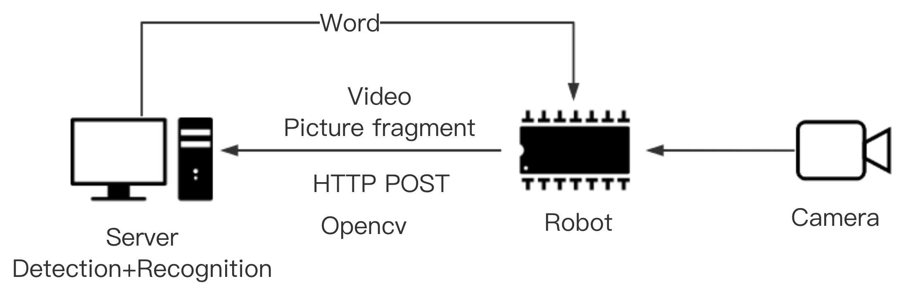

# 检测方案

由于目前端到端模型较少，并且训练难度大，故采取拆分的方式。将任务分为**检测**，**识别** 两部分。

## 检测

考虑到我们机场检测大部分场景难以达到**正视**效果，故优先采取可以检测斜体的方法。

### [seglink](http://mc.eistar.net/UpLoadFiles/Papers/SegLink_CVPR17.pdf)

1. [仓库地址](https://github.com/dengdan/seglink) `tensorflow`实现，提供训练好的模型以及训练脚本。
2. **训练** 数据可以使用[vgg生成](http://www.robots.ox.ac.uk/~vgg/data/scenetext/)(生成好的有`800万`)，在有一定学习能力之后进行finetune，finetune需要使用我们的数据。
3. **缺点** 对于不连续的文字识别效果差。
4. **速度** MSRA数据集上（分辨率从`1296x864`到1`920x1280`）可以达到`10fps`左右。

### EAST

1. [仓库地址](https://github.com/argman/EAST) `tensorflow`实现，提供训练好的`ICDAR`模型以及训练脚本。
2. **训练同seglink**
3. **速度** `1080ti 16fps`。

### CTPN

1. [仓库地址](https://github.com/tianzhi0549/CTPN) `caffe`实现，提供训练好的模型但不提供训练脚本。
2. **缺点** 水平文字识别，不能识别斜体，我修改源代码后可以实现将预测框变为倾斜框。**但bounding box可能会有些松。**
3. **速度** 在`gtx980`上分辨率`max(wdith,height)=1000`的图片`5fps`。

### TextBoxes

1. [仓库地址](https://github.com/MhLiao/TextBoxes) `caffe`实现，提供训练好的`ICDAR`模型以及训练脚本。
2. **训练同seglink**
3. **缺点** 水平文字，但是作者与`CRNN`结合完成定位+识别方案。
4. **速度** 大致`10fps`。

## 识别

### 类CRNN方法

1. **仓库地址** 
   - [caffe](https://github.com/senlinuc/caffe_ocr)实现。
   - [tensorflow](https://github.com/chineseocr/chinese-ocr)提供训练好的模型以及练脚本。

### Attention based

1. [仓库地址](https://github.com/tensorflow/models/tree/master/research/attention_ocr) `tensorflow`实现，提供模型。
2. 猜测速度比较慢。

## 集成方案

初步定为`server`的形式。

在该方案中，`server`端使用`python`进行服务，原因为`caffe`，`tensorflow`均提供`python`接口，`python`也可以使用`FLASK`提供`web`服务，`robot`小车使用`opencv`截取图片后使用`request`发送`post异步请求`即可。时间设置为每秒发送一次。